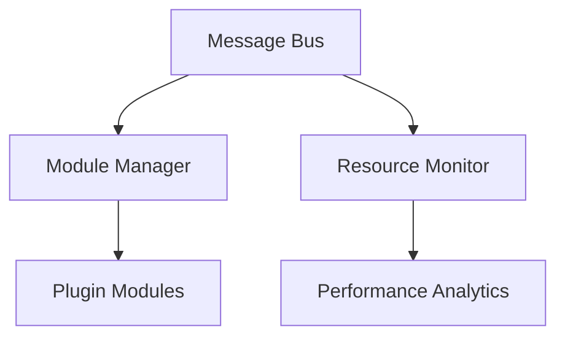
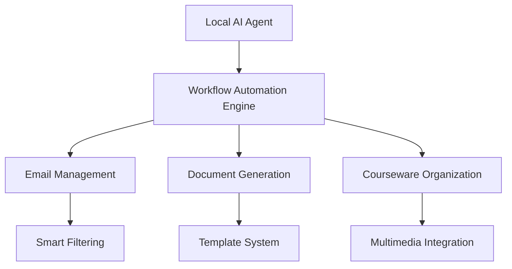

<!--
 * @Author: @ydzat
 * @Date: 2025-01-31 22:06:43
 * @LastEditors: @ydzat
 * @LastEditTime: 2025-02-03 22:44:31
 * @Description: Bilingual README for AI Personal Assistant Core
-->

# AI Personal Assistant Core / AI个人助理核心

## Overview / 概述

This project is a modular AI personal assistant system core designed to support dynamic module loading, message routing, and resource monitoring. It leverages ZeroMQ for communication and is optimized for both CPU and GPU environments.  
本项目是一个模块化的AI个人助理系统内核，支持动态模块加载、消息路由和资源监控。它利用ZeroMQ进行通信，并针对CPU和GPU环境进行了优化。

(PS: In the initial stage, most functions have not yet been realized. / 草创阶段，大多功能尚未实现。)

## Core Architecture / 核心架构



- **Message Bus**: Facilitates communication between modules using a publish-subscribe pattern.  
  **消息总线**：使用发布-订阅模式促进模块之间的通信。
- **Module Manager**: Handles dynamic loading and unloading of modules.  
  **模块管理器**：处理模块的动态加载和卸载。
- **Resource Monitor**: Monitors system resources to ensure efficient operation.  
  **资源监控器**：监控系统资源以确保高效运行。

## 🖥️ Platform Compatibility / 平台兼容性

### Currently Supported / 当前支持  
| Platform | Tested Version | Core Features | Notes |  
|----------|----------------|---------------|-------|  
| **Windows** | 10/11 22H2+ | Full functionality | GPU acceleration requires NVIDIA GPU |  
| **Linux** | Fedora 38+ | Full functionality | Optimized for GNOME/KDE desktop environments |  

### Future Consideration / 未来考量  
| Platform | Status | Timeline |  
|----------|--------|----------|  
| macOS | Not planned | - |  
| Android/iOS | Not planned | - |  

## Quick Start / 快速启动

1. **Environment Setup** / **环境设置**:
   ```bash
   conda env create -f environment.yml
   conda activate ai-assistant
   ```

2. **Run the Core** / **运行核心**:
   ```bash
   python -m core.main --log-level INFO
   ```

3. **Run Tests** / **运行测试**:
   ```bash
   pytest test/test_integration -v
   ```
   *PS: Core service is automatically managed during testing / 注：测试时无需手动运行核心服务*

## Key Features / 核心功能

| Feature | Description | 功能描述 |
|---------|-------------|----------|
| 🔌 Dynamic Module System | Hot-swappable modules with dependency resolution | 支持依赖解析的模块热插拔 |
| 🚀 GPU Accelerated | CUDA-optimized components for AI workloads | 为AI计算优化的CUDA组件 |
| 🔒 Privacy First | Local data processing with AES-256 encryption | 本地化数据处理与AES-256加密 |
| 🌐 Multi-Protocol Support | ZeroMQ + Protobuf + REST API interfaces | 多协议通信支持 |

## Development Guide / 开发指南

### Module Development / 模块开发
```python
class MyModule(BaseModule):
    def handle_message(self, envelope):
        """Process incoming messages"""
        return ResponseBuilder.success(data=processed_data)
```

### API Documentation / 接口文档
```bash
# Generate API docs
pdoc3 --html core/ --force
```

## 🌐 Core Technical Vision / 核心技术愿景



**English**  
Our ultimate goal is to create an **AI-driven digital workforce** that operates as a persistent background service on personal computing devices. Through deep integration with local system resources and secure sandboxed execution, the assistant will:  
- Automate repetitive workflows (Email triage, document drafting, course material curation)  
- Learn user patterns via privacy-preserving machine learning  
- Provide proactive suggestions while maintaining full user control  
- Maintains 50+ conversation context depth
- Role-playing with 100+ character templates
- Automatic performance tuning via RLHF
- 
**中文**  
致力于打造**AI驱动的数字化劳动力**，作为常驻后台服务深度融入个人计算设备。通过本地系统资源整合与安全沙箱化执行，助手将实现：  
- 自动化重复工作流（邮件处理、文档草拟、课件整理）  
- 通过隐私保护型机器学习理解用户模式  
- 在保持用户完全控制权的前提下提供主动建议  
- 支持50+轮对话的上下文记忆
- 提供多种角色扮演模板
- 通过强化学习实现自动优化

### Key Technical Advantages / 关键技术优势  
```diff
+ 本地化AI推理引擎 支持CPU/GPU混合计算
+ 工作流可视化编辑器 (WYSIWYG)
+ 沙箱化执行保障系统安全
+ 跨Windows/Linux的标准化API接口
```

### 🚀 Technical Milestones / 技术里程碑

| Phase | Target | 阶段目标 |
|-------|--------|----------|
| 2025.Q3 | Achieve 95% module hot-swap success rate | 实现95%模块热插拔成功率 |
| 2026.Q1 | Support 10+ IoT device protocols | 支持10+种物联网协议 |
| 2026.Q4 | Implement federated learning framework | 实现联邦学习框架 |


## Community / 社区

[](CONTRIBUTING.md)

**We Value Your:**
- Module contributions 🧩
- Localization support 🌍
- Use case studies 📊

**我们期待您的:**
- 功能模块贡献 🧩
- 多语言支持 🌍
- 应用场景案例 📊

## LICENSE / 许可证

[](https://www.gnu.org/licenses/agpl-3.0)

This project is licensed under the **GNU Affero General Public License v3 (AGPL-3.0)**.  
This means you are free to use, modify, and distribute this software **as long as you also share your modifications under the same license**.

For commercial use, please contact us at ydzat@live.com
