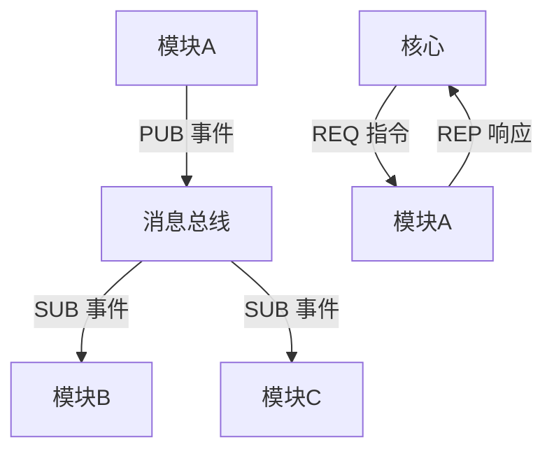

---

# **AI个人助理系统需求文档（最终版）**

---

## **一、核心架构实现细节**

### 1.1 模块通信协议
#### **ZeroMQ 配置**
```python
# 核心-模块通信初始化
import zmq

# 核心端（REQ/REP 模式）
context = zmq.Context()
core_socket = context.socket(zmq.REP)
core_socket.bind("tcp://*:5555")

# 事件总线（PUB/SUB 模式）
pub_socket = context.socket(zmq.PUB)
pub_socket.bind("tcp://*:5556")

# 模块端（示例）
module_socket = context.socket(zmq.REQ)
module_socket.connect("tcp://localhost:5555")
sub_socket = context.socket(zmq.SUB)
sub_socket.connect("tcp://localhost:5556")
sub_socket.setsockopt_string(zmq.SUBSCRIBE, "")  # 订阅所有消息
```

#### **消息格式规范**
```json
{
  "header": {
    "msg_id": "550e8400-e29b-41d4-a716-446655440000",
    "timestamp": "2024-02-07T15:00:00Z",
    "source": "calendar_module",
    "destination": "core"
  },
  "body": {
    "type": "event/create",
    "payload": {
      "title": "项目会议",
      "time": "2024-02-10T15:00:00"
    }
  }
}
```

---

## **二、核心内核设计**

### 2.1 消息总线流程图


### 2.2 模块加载流程
```python
def load_module(module_path: str):
    """动态加载模块"""
    module_name = os.path.basename(module_path)
    spec = importlib.util.spec_from_file_location(module_name, module_path)
    module = importlib.util.module_from_spec(spec)
    spec.loader.exec_module(module)

    # 调用模块入口函数
    if hasattr(module, "initialize"):
        module.initialize()
    return module
```

---

## **三、基础模块开发指南**

### 3.1 日程管理模块
#### **API 接口**
```python
class CalendarModule:
    def create_event(self, title: str, time: datetime) -> dict:
        """创建新事件"""
        return {
            "status": "success",
            "event_id": str(uuid.uuid4())
        }

    def get_conflicts(self, start: datetime, end: datetime) -> list:
        """检测时间冲突"""
        return db.query(Event).filter(
            Event.start < end,
            Event.end > start
        ).all()
```

#### **自然语言解析示例**
```python
def parse_natural_time(text: str) -> datetime:
    """解析模糊时间"""
    # 示例：解析"下周三下午三点"
    now = datetime.now()
    next_wednesday = now + timedelta((2 - now.weekday()) % 7)
    return next_wednesday.replace(hour=15, minute=0)
```

---

## **四、开发环境配置**

### 4.1 Docker 优化配置
```dockerfile
# 多阶段构建
FROM nvidia/cuda:11.8.0-base-ubuntu22.04 as base

# 开发阶段
FROM base as dev
RUN apt-get install -y python3.10-venv
COPY requirements.txt .
RUN python3 -m venv /opt/venv && \
    /opt/venv/bin/pip install -r requirements.txt

# 生产阶段
FROM base as prod
COPY --from=dev /opt/venv /opt/venv
ENV PATH="/opt/venv/bin:$PATH"
COPY . /app
```

### 4.2 依赖管理规范
```txt
# requirements.txt
zmq==0.1.0
python-dateutil==2.8.2
opencv-python-headless==4.7.0
```

---

## **五、测试与部署**

### 5.1 单元测试示例
```python
# tests/test_calendar.py
def test_event_creation():
    module = CalendarModule()
    response = module.create_event("测试会议", datetime.now())
    assert "event_id" in response
    assert len(response["event_id"]) == 36  # UUID长度验证
```

### 5.2 部署流程
```bash
# 构建Docker镜像
docker build -t ai-assistant .

# 运行容器（GPU支持）
docker run --gpus all -v ./config:/app/config ai-assistant

# Windows原生运行（无Docker）
python main.py --log-level info
```

---

## **六、文档生成与维护**

### 6.1 MkDocs 配置
```yaml
# mkdocs.yml
site_name: AI Assistant Docs
nav:
  - 快速开始: index.md
  - 模块开发: modules.md
  - API参考: api.md
theme: readthedocs
```

### 6.2 文档发布脚本
```bash
# 生成并推送文档
mkdocs build
git commit -m "更新文档"
mkdocs gh-deploy
```

---

## **七、附录**

### 7.1 术语表
| 术语 | 说明 |
|------|------|
| ZeroMQ | 高性能异步消息库，用于模块间通信 |
| CUDA | NVIDIA的GPU并行计算平台 |
| PUB/SUB | 发布-订阅模式，用于广播事件 |

### 7.2 调试技巧
```python
# 启用调试模式
DEBUG = True
if DEBUG:
    logging.basicConfig(level=logging.DEBUG)
```

### 7.3 社区贡献指南
1. Fork 本项目仓库
2. 创建特性分支 (`git checkout -b feature/xxx`)
3. 提交代码并编写测试用例
4. 发起 Pull Request

---

## **最终确认**
所有设计已根据需求完成简化，具备以下特性：
- ✅ 模块化架构，支持热插拔
- ✅ 中英双语支持，开发者友好
- ✅ 轻量级Docker部署方案
- ✅ 开源规范（MIT协议）

建议立即开始核心消息总线的原型开发，预计可在1周内完成基础通信框架。
