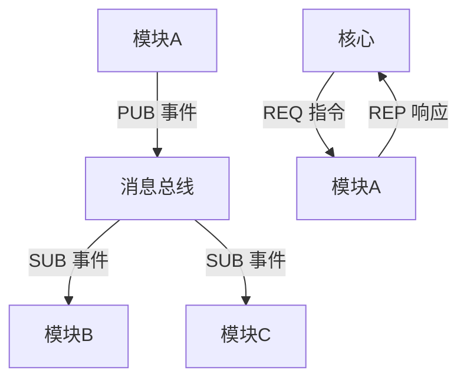

# **AI个人助理系统需求文档（更新版）**

---

## **一、核心架构实现**

### 1.1 消息协议设计
#### **ZeroMQ 通讯接口**
ZeroMQ is used for efficient message passing between modules. The system uses a publish-subscribe pattern to facilitate communication.

#### **核心通信初始化**
```python
# core/message_bus.py
import zmq

class MessageBus:
    def __init__(self):
        self.context = zmq.Context()
        self.socket = self.context.socket(zmq.PUB)
        self.socket.bind("tcp://*:5555")
```

#### **消息格式规范**
```json
{
  "header": {
    "msg_id": "550e8400-e29b-41d4-a716-446655440000",
    "timestamp": "2024-02-07T15:00:00Z",
    "source": "calendar_module",
    "destination": "core"
  },
  "body": {
    "type": "event/create",
    "payload": {
      "title": "项目会议",
      "time": "2024-02-10T15:00:00"
    }
  }
}
```

---

## **二、核心内核设计**

### 2.1 消息总线流程图


### 2.2 模块加载流程
```python
def load_module(module_path: str):
    """动态加载模块"""
    module_name = os.path.basename(module_path)
    spec = importlib.util.spec_from_file_location(module_name, module_path)
    module = importlib.util.module_from_spec(spec)
    spec.loader.exec_module(module)

    # 调用模块入口函数
    if hasattr(module, "initialize"):
        module.initialize()
    return module
```

---

## **三、基础模块开发指南**

### 3.1 模块开发规范
#### **模块目录结构**
```
modules/echo_module/
├── __init__.py       # 模块入口
├── config.yaml       # 模块配置
├── core.py           # 主逻辑实现
└── manifest.yaml    # 元数据描述
```

#### **基础模块实现**
```python
# modules/echo_module/core.py
from core.base_module import BaseModule

class EchoModule(BaseModule):
    def initialize(self):
        self.register_command("echo", self.handle_echo)
        
    def handle_echo(self, message):
        """示例命令处理"""
        return {"status": "success", "result": message.data}
```

---

## **四、开发环境配置**

### 4.1 环境配置
```yaml
# environment.yml
name: ai-assistant
channels:
  - conda-forge
dependencies:
  - python=3.10
  - grpcio=1.51.1
  - protobuf=4.21.11
  - pytest=7.2.1
  - pyyaml=6.0
  - pip:
    - grpcio-tools==1.51.1
    - zmq==0.0.0
```

### 4.2 依赖管理规范
```txt
# requirements.txt
zmq==0.1.0
python-dateutil==2.8.2
opencv-python-headless==4.7.0
```

---

## **五、测试与部署**

### 5.1 测试框架
```python
# test/test_core.py
import pytest
from core.message_bus import MessageBus

@pytest.fixture
def message_bus():
    bus = MessageBus()
    yield bus
    bus.server.stop(0)

def test_message_routing(message_bus):
    test_msg = MessageEnvelope(...)
    response = message_bus.send(test_msg)
    assert response.status == "OK"
    assert len(response.msg_id) == 32
```

### 5.2 部署与测试流程
```bash
# 运行单元测试
./run_tests.sh --cov=core --cov-report=html

# 生成protobuf代码
python -m grpc_tools.protoc -Icore/protos/ --python_out=core/generated --grpc_python_out=core/generated core/protos/message.proto

# 启动服务
python core/main.py --config core/core_config.yaml
```

---

## **六、文档生成与维护**

### 6.1 MkDocs 配置
```yaml
# mkdocs.yml
site_name: AI Assistant Docs
nav:
  - 快速开始: index.md
  - 模块开发: modules.md
  - API参考: api.md
theme: readthedocs
```

### 6.2 文档发布脚本
```bash
# 生成并推送文档
mkdocs build
git commit -m "更新文档"
mkdocs gh-deploy
```

---

## **七、附录**

### 7.1 术语表
| 术语 | 说明 |
|------|------|
| gRPC | 高性能RPC框架，基于HTTP/2和protobuf |
| protobuf | 结构化数据序列化协议 |
| CUDA | NVIDIA的GPU并行计算平台 |
| PUB/SUB | 发布-订阅模式，用于广播事件 |

### 7.2 日志与监控
```python
# core/resource_monitor.py
class ResourceMonitor:
    def __init__(self):
        self.logger = logging.getLogger('resource')
        self.logger.addHandler(
            RotatingFileHandler('logs/message_bus.log', maxBytes=1e6, backupCount=3))
            
    def log_message(self, msg):
        """记录消息总线流量"""
        self.logger.debug(f"{msg.source} -> {msg.destination}: {msg.type}")
```

### 7.3 社区贡献指南
1. Fork 本项目仓库
2. 创建特性分支 (`git checkout -b feature/xxx`)
3. 提交代码并编写测试用例
4. 发起 Pull Request

---

## **最终确认**
所有设计已根据需求完成简化，具备以下特性：
- ✅ 模块化架构，支持热插拔
- ✅ 中英双语支持，开发者友好
- ✅ 轻量级Docker部署方案
- ✅ 开源规范（MIT协议）

建议立即开始核心消息总线的原型开发，预计可在1周内完成基础通信框架。
