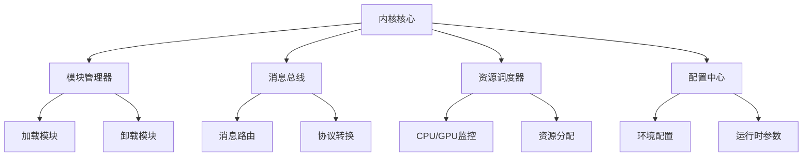
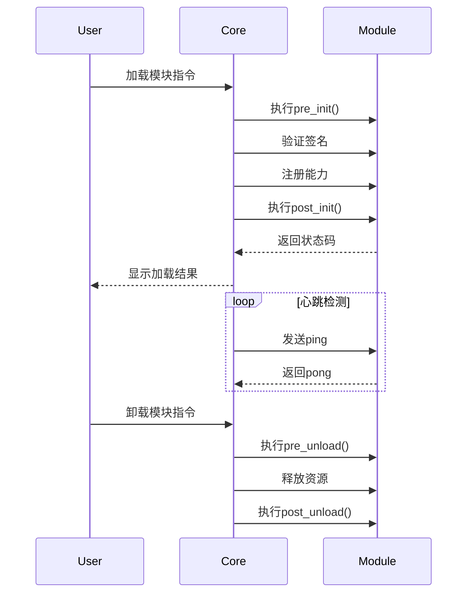

# **AI个人助理系统内核设计文档**

## **1. 内核核心架构**

### 1.1 架构总览


### 1.2 核心组件定义
| 组件 | 职责 | 关键技术 |
|------|------|----------|
| 模块管理器 | 生命周期管理、依赖解析 | 动态导入、依赖图算法 |
| 消息总线 | 模块间通信、协议转换 | ZeroMQ、Protobuf |
| 资源调度器 | 硬件资源监控与分配 | psutil、CUDA Runtime API |
| 配置中心 | 统一配置管理 | YAML解析、环境变量注入 |

---

## **2. 核心功能设计**

### 2.1 模块生命周期管理
#### 生命周期流程图


#### 关键数据结构
```python
class ModuleMeta:
    name: str          # 模块唯一标识
    version: str       # 语义化版本号
    dependencies: List[str]  # 依赖模块列表
    capabilities: List[str]  # 提供的能力列表
    entry_point: str   # 入口类路径
```

---

### 2.2 消息总线协议

#### 协议层次设计
```
+-------------------+
|   应用层协议       |  # 自定义业务消息格式
+-------------------+
|   传输层协议       |  # ZeroMQ (REQ/REP + PUB/SUB)
+-------------------+
|   网络层协议       |  # TCP/IP
+-------------------+
```

#### 消息格式规范
```protobuf
// core/message.proto
syntax = "proto3";

message MessageHeader {
  string msg_id = 1;        // UUIDv4
  string timestamp = 2;     // ISO8601
  string source = 3;        // 源模块ID
  repeated string route = 4;// 消息路由路径
}

message MessageBody {
  enum MessageType {
    COMMAND = 0;
    EVENT = 1;
    DATA = 2;
  }

  MessageType type = 1;
  string command = 2;       // 指令标识
  bytes payload = 3;        // 透传数据
}

message Envelope {
  MessageHeader header = 1;
  MessageBody body = 2;
}
```

---

### 2.3 资源管理策略

#### GPU资源分配算法
```python
def allocate_gpu(module: ModuleMeta):
    total_mem = torch.cuda.get_device_properties(0).total_memory
    used_mem = torch.cuda.memory_allocated(0)

    # 动态分配策略
    if module.requires_gpu:
        reserved = min(1024**3, total_mem - used_mem)  # 预留1GB基础
        allocatable = (total_mem - used_mem - reserved) * 0.8
        return allocatable
    return 0
```

#### 资源监控指标
| 指标 | 采集频率 | 告警阈值 |
|------|----------|----------|
| CPU使用率 | 5秒 | >90%持续30秒 |
| GPU显存 | 1秒 | >95% |
| 模块内存 | 10秒 | >512MB |

---

## **3. 核心接口规范**

### 3.1 模块开发接口
```python
class BaseModule(ABC):
    @abstractmethod
    def handle_message(self, envelope: Envelope) -> Envelope:
        """消息处理入口"""
        pass

    @classmethod
    def pre_init(cls):
        """预初始化钩子"""

    @classmethod
    def post_init(cls):
        """后初始化钩子"""

    @classmethod
    def get_metadata(cls) -> ModuleMeta:
        """必须实现的元数据方法"""
```

### 3.2 系统调用接口
```python
class CoreAPI:
    @staticmethod
    def send_message(target: str, envelope: Envelope):
        """发送消息到指定模块"""

    @staticmethod
    def request_resource(res_type: str, amount: float) -> bool:
        """申请资源（CPU/GPU/Memory）"""

    @staticmethod
    def get_config(key: str) -> Any:
        """获取配置项"""
```

---

## **4. 异常处理机制**

### 4.1 错误等级分类
| 等级 | 处理方式 | 示例场景 |
|------|----------|----------|
| FATAL | 终止进程 | 内存溢出 |
| ERROR | 卸载模块 | 消息处理超时 |
| WARNING | 记录日志 | 资源不足 |
| DEBUG | 仅记录 | 临时文件未清理 |

### 4.2 错误代码体系
```python
class ErrorCode(Enum):
    # 系统级错误 1000-1999
    MODULE_LOAD_FAILED = 1001
    MSG_TIMEOUT = 1002

    # 资源类错误 2000-2999
    GPU_MEM_FULL = 2001

    # 模块级错误 3000-3999
    INVALID_MSG_FORMAT = 3001
```

---

## **5. 开发规范**

### 5.1 模块开发模板
```
my_module/
├── manifest.yaml      # 模块声明
├── requirements.txt   # 依赖声明
├── src/
│   ├── __init__.py
│   └── main.py        # 实现BaseModule
└── tests/
    └── test_basic.py
```

### 5.2 日志规范
```python
# 统一日志格式
from loguru import logger

logger.add("logs/core.log",
           format="{time:YYYY-MM-DD HH:mm:ss} | {level} | {module}:{function} - {message}",
           rotation="100 MB")
```

---

## **6. 测试策略**

### 6.1 核心测试用例
```python
def test_module_lifecycle():
    # 加载测试模块
    core.load_module("test_module")

    # 验证模块注册
    assert "test_module" in core.modules

    # 发送测试消息
    response = core.send_message("test_module", test_envelope)

    # 验证响应格式
    assert validate_proto(response)

    # 卸载模块
    core.unload_module("test_module")
    assert "test_module" not in core.modules
```

### 6.2 性能基准测试
```bash
# 消息吞吐量测试
python -m core.benchmark --msg-count 100000

# 内存泄漏检测
pytest --memray tests/
```

---

## **7. 部署说明**

### 7.1 最低硬件要求
| 组件 | 要求 |
|------|------|
| CPU | x86_64架构，4核以上 |
| GPU | NVIDIA Pascal架构+（可选） |
| 内存 | 8GB+ |
| 存储 | 10GB可用空间 |

### 7.2 推荐conda环境
```yaml
# environment.yml
name: ai-core
channels:
  - pytorch
  - conda-forge
dependencies:
  - python=3.10
  - pyzmq=25.1
  - loguru=0.7
  - pytorch=2.2.1
  - cudatoolkit=11.8
  - protobuf=4.25
```
